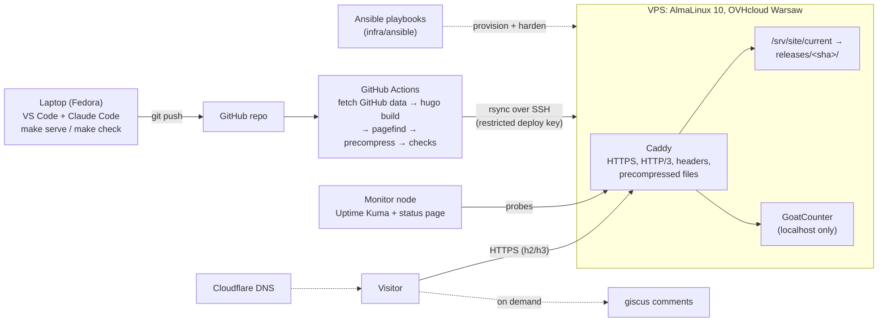

# Architecture

## Target state (end of Phase 3)

## How a page gets to a visitor

1. You write Markdown in `content/en/...` and push.
2. CI runs the same `make check` you run locally, then builds `public/` (plain HTML + inlined CSS).
3. CI copies the build into a new folder `releases/<commit-sha>/` on the server, then flips the
   `current` symlink to it in one atomic step. Old releases stay for instant rollback.
4. Caddy serves files from `current`, choosing the pre-built `.br`/`.gz` version the browser supports.

## Repository map

| Path | What lives there |
|---|---|
| `content/{en,pl}/` | Markdown pages and posts (page bundles: `blog/<slug>/index.md` + images) |
| `layouts/` | Hugo templates: `baseof.html` frame, `home/list/single.html`, `_partials/` |
| `assets/css/main.css` | The only stylesheet, inlined into every page |
| `i18n/` | UI strings per language |
| `data/` | Structured data (GitHub repos JSON, curated project list), from step 2.2 |
| `infra/ansible/` | Server provisioning and hardening |
| `.github/workflows/` | CI (build/check), deploy from step 1.4 |
| `docs/` | This file, roadmap, decisions (ADRs), research, content guide, runbooks |
| `.claude/` | Claude Code permissions and custom slash commands |

## Decisions

See `docs/decisions/`. Current: 0001 Hugo, 0002 Caddy, 0003 AlmaLinux, 0004 OVHcloud Warsaw,
0005 no CDN at launch, 0006 pinned tool checksums.
